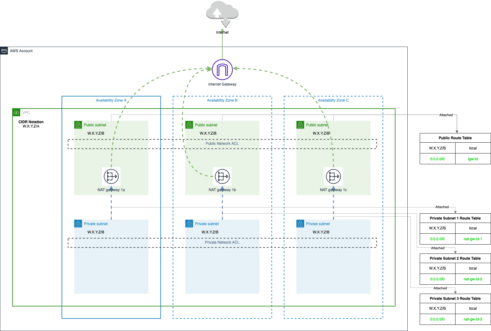

# Standalone VPC module

Este módulo es usado para crear una VPC en AWS, con todo lo necesario para poder gestionar dos zonas de red independientes, una pública y otra privada. La VPC consta de:

- Una VPC.
- `n` subredes públicas donde `n` es igual a la cantidad de zonas de disponibilidad disponibles en la región seleccionada.
- `n` subredes privadas donde `n` es igual a la cantidad de zonas de disponibilidad disponibles en la región seleccionada.
- Un Internet Gateway para enrutar el tráfico a internet desde IPs públicas
- `n` NAT Gateways, uno en cada subred pública.
- Una tabla de rutas pública para enrutar el tráfico de las subredes públicas, con una ruta para internet a través del Internet Gateway y con posibilidad de definir rutas extra usando variables.
- Una tabla de rutas por subred privada para enrutar el tráfico de las subredes privadas, con una ruta en cada tabla de rutas que enruta el tráfico a internet a través del NAT Gateway disponible en su zona de disponibilidad y con posibilidad de definir rutas extra usando variables.
- Dos ACLs, uno público asociado a las subredes públicas y otro privado asociado a las subredes privadas. En ambos ACLs se define una regla de entrada y otra de salida que acepta todo el tráfico y se pueden definir reglas extra usando variables.



El modulo está preparado para hacer subnetting, generando una pool de direcciones de red para posteriormente usarlas en las subredes. Esta función espera recibir un CIDR y una mascara de red hacia la que hacer subnetting. En base a esos valores, el módulo genera la pool de CIDRs de subnetting y calcula que sean las suficientes para crear las subredes necesarias. Ej: Un CIDR con valor "192.168.0.0/21" y una máscara para subnetting con valor "24" genera una pool de 8 subredes, las cuales son suficientes para una región con 3 zonas de disponibilidad, ya que se requieren 6 subredes para las subredes públicas y privadas.

## Variables

| Input Variable    | type        | Required | default   | Description                                                                                             |
|-------------------|-------------|----------|-----------|---------------------------------------------------------------------------------------------------------|
| m_aws_region      | string      | no       | eu-west-1 | AWS region in which to create the VPC.                                                                  |
| m_name            | string      | yes      |           | Base name used for resources created by this module.                                                    |
| m_cidr_block      | string      | yes      |           | The IPv4 CIDR block for the VPC. Must contain the mask.                                                 |
| m_subneting_mask  | number      | yes      |           | Mask for making subnetting from the CIDR block and use those subnetted blocks for creating the subnets. |
| m_global_routes   | map(object) | no       | {}        | Map with global routes to add into all route tables.                                                    |
| m_public_routes   | map(object) | no       | {}        | Map with routes to add into public route tables.                                                        |
| m_private_routes  | map(object) | no       | {}        | Map with routes to add into private route table.                                                        |
| m_global_egress   | map(object) | no       | {}        | Map with global egress rules to add into all Network ACLs.                                              |
| m_public_egress   | map(object) | no       | {}        | Map with public egress rules to add into public Network ACL.                                            |
| m_private_egress  | map(object) | no       | {}        | Map with private egress rules to add into private Network ACL.                                          |
| m_global_ingress  | map(object) | no       | {}        | Map with global ingress rules to add into all Network ACLs.                                             |
| m_public_ingress  | map(object) | no       | {}        | Map with public ingress rules to add into public Network ACL.                                           |
| m_private_ingress | map(object) | no       | {}        | Map with private ingress rules to add into private Network ACL.                                         |

### m_x_routes objects

En esta sección vamos a ver los objetos necesarios para generar las rutas tato públicas como privadas. Disponemos de 3 variables con el mismo tipo de objeto, pero cada una de ellas aplicará las rutas a trablas de rutas diferentes:

- **m_global_routes:** Aplica las rutas tanto en tablas de rutas públicas como privadas.
- **m_public_routes:** Aplica las rutas solo en las tablas de rutas públicas.
- **m_private_routes:** Aplica las rutas solo en las tablas de rutas privadas.

| keys                      | type   | Required | default | Description                                                                   |
|---------------------------|--------|----------|---------|-------------------------------------------------------------------------------|
| cidr_block                | string | yes      |         | CIDR Block used by the route to send traffic to. Must contain IP and mask.    |
| gateway_id                | string | no       |         | AWS Internet Gateway ID to route traffic through.                             |
| nat_gateway_id            | string | no       |         | AWS NAT Gateway ID to route traffic through.                                  |
| network_interface_id      | string | no       |         | AWS Network Interface ID to route traffic through.                            |
| transit_gateway_id        | string | no       |         | AWS Transit Gateway ID to route traffic through.                              |
| vpc_endpoint_id           | string | no       |         | AWS VPC Endpoint ID to route traffic through.                                 |
| vpc_peering_connection_id | string | no       |         | AWS Peering Connection ID to route traffic through.                           |

### m_x_egress y m_x_ingress objects

En esta sección vamos a ver los objetos necesarios para generar las reglas de ACL ed entrada y salida, tanto públicas como privadas. Disponemos de 6 variables con el mismo tipo de objeto, pero cada una de ellas aplicará las reglas en ACLs diferentes:

- **m_global_egress:** Aplica las reglas de salida tanto en el ACL público como privado.
- **m_public_egress:** Aplica las reglas de salida en el ACL público.
- **m_private_egress:** Aplica las reglas de salida en el ACL privado.

- **m_global_ingress:** Aplica las reglas de entrada tanto en el ACL público como privado.
- **m_public_ingress:** Aplica las reglas de entrada en el ACL público.
- **m_private_ingress:** Aplica las reglas de entrada en el ACL privado.

## Usage

En este ejemplo, se crea un network ACL con el nombre "acl-test-public", con una regla de entrada y otra de salida configuradas para aceptar todo tipo de tráfico a cualquier destino y dos etiquetas personalizadas. Este ejemplo muestra cómo llamar al módulo desde un módulo componente de la propia librería:

```terraform
module "public_network_acl" {
  source = "../../resources/networkACL"
  m_name        = "test"
  m_name_suffix = "public"
  m_vpc_id      = "vpc-xxxxxxx"
  m_ingress_rules = {
    "100" = {
      action = "allow"
      from_port   = 0
      to_port     = 0
      protocol    = "-1"
      cidr_block  = "0.0.0.0/0"
    }
  }
  m_egress_rules = {
    "100" = {
      action = "allow"
      from_port   = 0
      to_port     = 0
      protocol    = "-1"
      cidr_block  = "0.0.0.0/0"
    }
  }
  m_tags        = {
    Environment = "develop"
    Project     = "example"
  }
}
```

Para llamar directamente a este módulo desde fuera de la librería sería de la siguiente forma:

```terraform
module "public_network_acl" {
  source          = "git@github.com:MoiVilella/tf_aws_networking_library//modules/resources/networkACL?ref=<tag_version>"
  m_name        = "test"
  m_name_suffix = "public"
  m_vpc_id      = "vpc-xxxxxxx"
  m_ingress_rules = {
    "100" = {
      action = "allow"
      from_port   = 0
      to_port     = 0
      protocol    = "-1"
      cidr_block  = "0.0.0.0/0"
    }
  }
  m_egress_rules = {
    "100" = {
      action = "allow"
      from_port   = 0
      to_port     = 0
      protocol    = "-1"
      cidr_block  = "0.0.0.0/0"
    }
  }
  m_tags        = {
    Environment = "develop"
    Project     = "example"
  }
}
```

**Nota:** Como se puede observar en la URL definida en el campo source hay que cambiar el valor `<tag_version>` por el tag de la versión de la librería que se deséa usar.